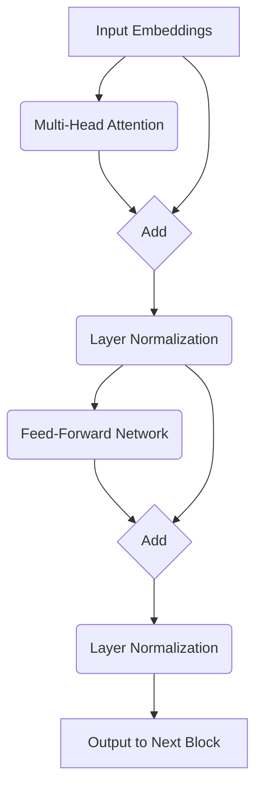

  <h1 align="center">Section 7: Introducing the Transformer Block</h1>

 

We've now mastered the most complex and important part of the Transformer: **Multi-Head Causal Attention**. But that's just one piece of a larger puzzle. This attention layer is housed inside a "Transformer Block" (also called a "Decoder Block" in GPT-style models).

A Transformer is simply a stack of these identical blocks, connected one after the other. The output of Block 1 becomes the input for Block 2, and so on.

## 🧱 The Architecture of a Transformer Block

A single Transformer block consists of two main sub-layers:

1.  **Multi-Head Attention Layer:** This is what we just learned. It takes in a set of vectors and produces a new set of context-rich vectors by allowing tokens to communicate with each other.
2.  **Feed-Forward Neural Network (FFN):** This is a standard, position-wise neural network. It takes the output from the attention layer and processes each token's vector individually. Think of this as the "thinking" or "computation" part of the block, where the model processes the information gathered by the attention mechanism.

Each of these sub-layers has two additional components wrapped around it:
* A **Residual Connection ("Add")**: This helps with training deep networks.
* A **Layer Normalization ("Norm")**: This stabilizes the training process.

So, the full flow through a single Transformer Block looks like this:

This can be described as:

> **Output = LayerNorm( Input_to_FFN + FFN( Input_to_FFN ) )**
> where
> **Input_to_FFN = LayerNorm( Input + MultiHeadAttention( Input ) )**

---

## 📚 Stacking the Blocks

A single block is useful, but the real power comes from stacking them. By passing the output of one block to the input of the next, the model can build up increasingly complex and abstract representations of the text.

* **Early Layers:** Might focus on basic syntax and local word relationships.
* **Middle Layers:** Might start to understand semantics, concepts, and long-range dependencies.
* **Final Layers:** Might grasp high-level themes, sentiment, and nuance.

### Layers in Real Models
The number of stacked Transformer blocks (or "layers") is a key factor in a model's size and capability.

* **GPT-2 (small):** 12 layers
* **GPT-3:** 96 layers
* **LLaMA 2 (7B):** 32 layers
* **LLaMA 2 (70B):** 80 layers

In the next sections, we will break down the remaining components of the block: the **Add & Normalize** layers and the **Feed-Forward Network**.